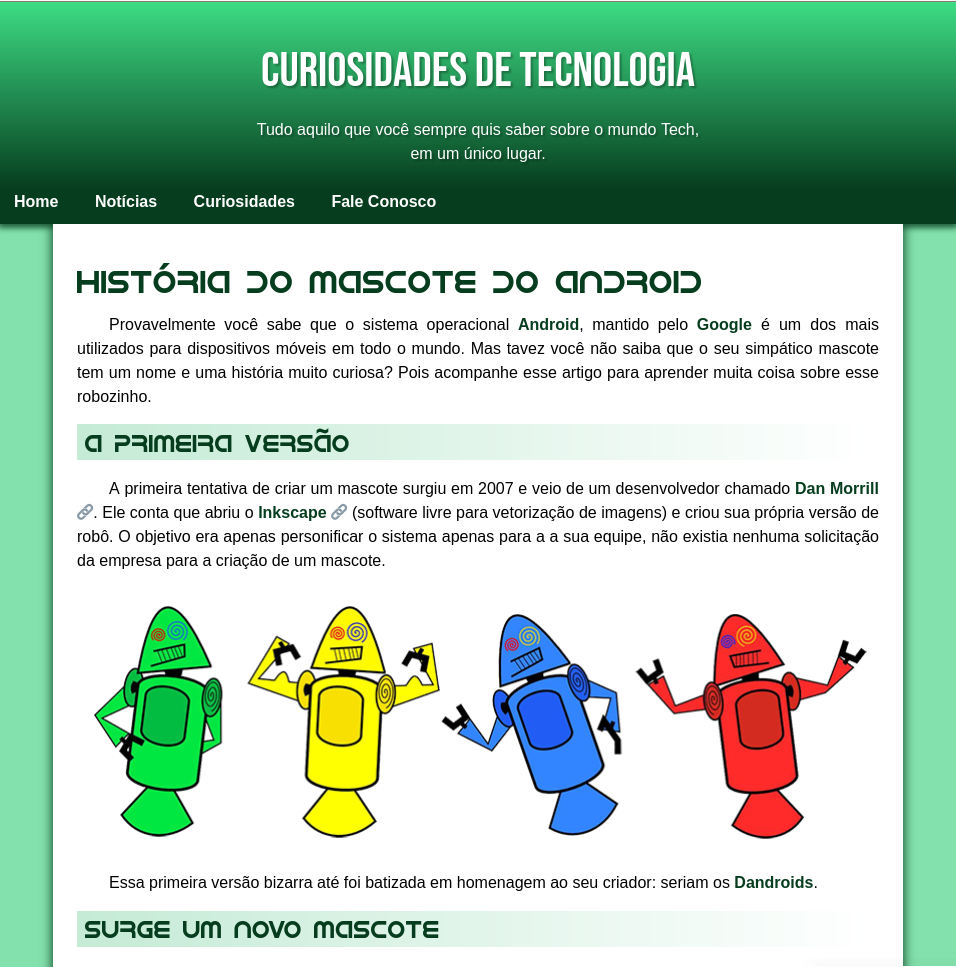

# Desafios do Curso de HTML5 e CSS3 do Curso em Vídeo

Repositório criado para praticar e relembrar conceitos básicos sobre HTML5 e CSS3, me baseando inicialmente nas aulas do [Curso em Cídeo](https://youtube.com/playlist?list=PLHz_AreHm4dkZ9-atkcmcBaMZdmLHft8n&si=fXCaqAvsF3xfCICY).

## Desafio do Android

